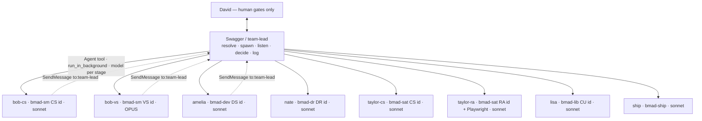

# BMAD Machinery Pattern

**What this is.** The STRUCTURE and ORCHESTRATION of David's semi-automated story lifecycle, distilled
from 70 mined story-run extracts (+4 queue sessions) spanning 6 months of SupportSignal BMAD runs
(stories 0.43 → 19.8, Apr–Jun 2026). The point is the **machinery** — the on-disk stigmergic layer that
carries context between stages and the orchestrator that drives stateless agents across it — NOT a
summary of what got built. The roster (Bob/Amelia/Nate/Taylor/Lisa) and the stack are swappable; the
machinery is the invariant.

**Evidence base.** Each claim cites the cluster(s) it came from as `[_ci N]` (the run-extract index) or
`[queue]`. Structural claims are cross-checked against the live system: orchestrator skill at
`~/dev/ad/appydave-plugins/appydave/skills/bmad-story-lifecycle/` (SKILL.md + 5 reference files) and the
one live BMAD repo `~/dev/clients/supportsignal/app.supportsignal.com.au` (carries `_bmad/` +
`_bmad-output/`; signal-studio / prompt.* do NOT run BMAD).

> **Naming — and lineage.** The orchestrator persona is **Swagger** ("Overwatch"), defined *inside*
> `bmad-story-lifecycle/SKILL.md`. The Dark-Factory job-agent skill also named `swagger`
> (`dark-factory/.claude/skills/swagger/`) shares the name **by design, not by accident** — DF's Swagger was
> created to inherit *this* Swagger's world-model and handoff strength. Same lineage, different maturity:
> the BMAD one is battle-tested but locked to one rigid workflow; the DF one aspires to the same
> orchestration across *flexible* workflow shapes (see §4 → Lineage note). This spec describes the BMAD
> orchestrator throughout — read it as the proven ancestor the DF Swagger is reaching for, not a stranger
> to keep at arm's length.

---

## 1. The lifecycle as a STATE MACHINE

Eight named gates. **Two are always human** (Bob VS, Ship); the rest auto-proceed unless an adverse
verdict trips a conditional human gate. Crucially, **stage count is data-driven by verdicts, not fixed** —
a clean story walks straight through; a story with defects spawns fix-loops and re-runs.
[_ci 1, 2, 10, 13]

```mermaid
stateDiagram-v2
    [*] --> Resolve: Step 0 — read sprint-status.yaml<br/>(in-progress > ready-for-dev > review > backlog)
    Resolve --> BobCS: story file does NOT exist yet
    Resolve --> BobVS: story already authored<br/>(E0-spawner / prior session)
    BobCS --> BobVS: auto (SendMessage verdict)
    BobVS --> HumanGate1: ALWAYS HUMAN (Opus quality gate)
    HumanGate1 --> AmeliaDS: David 'go' — orchestrator applies VS patches to story file
    HumanGate1 --> BobCSrw: FAIL — fresh bob-cs-rewrite, then fresh bob-vs-2
    BobCSrw --> BobVS
    AmeliaDS --> NateDR: auto (VERDICT: Implementation complete + CI triple-green)
    NateDR --> TaylorCS: PASS, 0 required patches (auto)
    NateDR --> FixGate: issues found (human gate)
    FixGate --> AmeliaFix: 'have amelia fix: [...]'
    AmeliaFix --> NateReReview: FRESH amelia-fix-N -> FRESH nate-N+1
    NateReReview --> TaylorCS: PASS
    NateReReview --> FixGate: still failing (loop, suffix++)
    TaylorCS --> TaylorRA: auto (SAT guide authored into story file)
    TaylorRA --> LisaCU: all pass / <=1 data-skip (auto)
    TaylorRA --> SATGate: genuine failure (human gate)
    SATGate --> AmeliaFix
    LisaCU --> SelfMaint: auto (status -> done; Overwatch doctrine pass)
    SelfMaint --> ShipGate: ALWAYS HUMAN
    ShipGate --> Ship: David 'go'
    Ship --> [*]: CI green, pushed, sprint-status -> done
    Ship --> Ship: push rejected (concurrent story) -> rebase/union-merge -> re-push
```



**Gate conditions (the verdict grammar that decides transitions, from `diagnostic-contracts.md`):**

| Gate | Auto / Human | Trip condition |
|---|---|---|
| Step 0 resolve | — | priority order `in-progress > ready-for-dev > review > backlog`, sorted epic then story# [SKILL.md, _ci 1] |
| Bob CS → VS | auto | `[VERDICT]: Story created` [_ci 9] |
| **Bob VS** | **ALWAYS human** | verdict `PASS / CONDITIONAL PASS / FAIL`. Never auto, regardless of verdict. [_ci 5, all] |
| Amelia DS → Nate | auto | `[VERDICT]: Implementation complete` **and** CI triple-green (lint→test→build) [_ci 1, 13] |
| **Nate DR** | conditional | `PASS` (0 required patches) → auto to Taylor; issues → human → fresh fix loop [_ci 0, cmdseq] |
| Taylor CS → RA | auto | SAT guide authored [_ci 19] |
| **Taylor RA** | conditional | all-pass OR `<=1` *data*-skip → auto; genuine failure → human [_ci 5, 7] |
| Lisa CU → SelfMaint | auto | `[VERDICT]: Curation complete`; Lisa sets `Status: done` [_ci 14] |
| **Ship** | **ALWAYS human** | only after explicit "go"; verdict `SUCCESS / FAILED / RECOVERED` [_ci 9, 12] |

**Lifecycle status states (the sprint-status.yaml `Status:` field — live ledger, 278 story rows):**
`backlog` → `ready-for-dev` → (`in-progress`) → `review` → (`ready-for-sat`) → `done`. Plus three
non-linear terminals the state machine must model:
- **`deferred`** — *parked, not killed*. "⏸ DEFERRED (David 2026-06-10) — NOT being built; NOT a blocker,
  just parked (not cancelled)." (story 14-20). `deferred ≠ cancelled ≠ backlog`. [live ledger]
- **`cancelled`** (20 rows) — deliberately killed; the inline comment carries *why* (the cleanest "spec
  caught as not-worth-building" signal). [live ledger]
- **`superseded-by-{id}` / `bundled-into-{id}`** — work rerouted into another story. [live ledger]

> Note: `review` is a **transient flip** Amelia/Nate write mid-run (23 story files show `Status → review`
> in their gate logs [live]); 0 stories *sit* at `review` in the current ledger because the next gate
> advances them. The resolver still lists it because a crashed mid-run story can be found there.

**Invariant constraints (SKILL.md "Key Constraints", non-negotiable — confirmed across all 70 runs):**
1. **Orchestrator never embodies agents** — never invokes `bmad-sm/dev/dr/sat/lib` itself.
2. **Bob VS gate is always human.**
3. **Fix loops always spawn FRESH agents** (`amelia-fix-1`, `nate-2`, `taylor-ra-2`) — never reuse a
   stale session. [_ci 0, 5, 29]
4. **Taylor runs Playwright/browser MTs automatically** — human never asked to run manual tests. [_ci 1]
5. **Ship only after explicit human "go".**
6. **Full diagnostic required before any gate clears** ("I don't clear a stage on a one-liner" [_ci 53]).

---

## 2. The ORCHESTRATION STRUCTURE (who spawns whom)

Swagger is the **team-lead** and the only hub — a star topology, never agent↔agent. It resolves the
story, spawns each stage as a *fresh, stateless* background teammate, listens for the verdict, decides the
gate, appends to the log, spawns the next. [_ci 0, 1, 9]



**Roster → skill → model (swappable roster, fixed mechanism):**

| Persona | Phase | Skill invoked (args) | Model | Why |
|---|---|---|---|---|
| Bob | CS | `bmad-sm CS {id}` | sonnet | authoring |
| Bob | VS | `bmad-sm VS {id}` | **opus** | "the quality gate that prevents bad stories reaching Amelia — one Opus call here is cheaper than a Nate FAIL + Amelia fix loop" [cmdseq, _ci 14, 24] |
| Amelia | DS | `bmad-dev DS {id}` | sonnet (opus if VS flags architectural complexity) [_ci 29] |
| Nate | DR | `bmad-dr DR {id}` | sonnet |
| Taylor | CS / RA | `bmad-sat CS\|RA {id}` | sonnet |
| Lisa | CU | `bmad-lib CU {id}` | sonnet |
| Ship | — | `bmad-ship` | sonnet |

**The exact delegation mechanism (and its drift).** Per `command-sequence.md` + SKILL.md the canonical
path is: `TeamCreate{team_name:'story-{id}'}` once → then per stage
`Agent{subagent_type:'general-purpose', team_name, name:'bob-cs', model, run_in_background:true,
prompt:<brief>}`. The spawn `prompt` is the **handoff vehicle** — it carries: (a) persona line ("You are
Bob, the BMAD Scrum Master"), (b) the absolute project root, (c) the exact `Invoke the Skill tool with
skill bmad-sm and args "CS {id}"`, (d) the absolute **story-file path**, (e) prior-stage findings + carry-
forward constraints distilled by the orchestrator, and (f) the mandated report-back contract. Children
report back via `SendMessage(to:"team-lead")` carrying `[VERDICT]/[SUMMARY]/[DIAGNOSTICS]/[NEXT GATE]`.
[_ci 1, 4, 9]

> **Verified drift (port-critical).** Three execution modes exist (`execution-modes.md`): **Mode 1**
> Agent Teams (default, in-process), **Mode 2** tmux visible panes (**BROKEN in CC 2.1.212**), **Mode 3**
> in-context sequential Skill calls (no spawning). The orchestrator detects mode via env
> (`CLAUDE_CODE_EXPERIMENTAL_AGENT_TEAMS`, `BMAD_VISIBLE_PANES`). Across the 6-month corpus the harness
> itself drifted: later runs (19.x, 0.10x) found **`TeamCreate` not exposed** and fell back to spawning
> named background agents *directly* via the `Agent` tool — "TeamCreate isn't present in this harness —
> the Agent tool's team_name is deprecated/ignored, so I spawn named teammates directly and they're
> addressable via SendMessage. That's the modern Mode-1 path." [_ci 2, 12, 22, 37, 47, 59]. The recipient
> name also drifted: `team-lead` (canonical, `TeamCreate` lead) in most runs; some June runs route to
> `main` [_ci 22]. **The mechanism that survives all drift: spawn-fresh-per-stage + report-up-a-contract.**

**Context passing is by reference, not value.** The orchestrator does NOT forward a child's full
transcript to the next child. It passes the **story-file path** + a compact distilled "verify, don't
trust" claim-block in the next spawn prompt; the child re-reads the on-disk story file cold. [_ci 2, 19]
Each child is a fresh context window — "trades tokens for independence, avoids context-bleed between
author and validator." [_ci 4]

---

## 3. The STRUCTURAL LAYER — the stigmergic on-disk substrate (the heart)

This is the "not just prompt engineering" part. Independently-spawned, memory-less agents coordinate by
**reading and writing shared files**, not by talking. The message bus is treated as unreliable ("Even a
correctly-addressed message to `main` does NOT reliably deliver its body" [_ci 22]); **the files are the
truth**. A run can survive total session death and resume from disk alone. [_ci 16] All paths verified in
`app.supportsignal.com.au`.

### A. THE STORY FILE — the per-story blackboard (the spine)
`_bmad-output/implementation-artifacts/{id}-{slug}.md` (268 flat) **and**
`_bmad-output/implementation-artifacts/stories/{id}-{slug}.md` (7 later epic stories) — **the resolver
reads both dirs**. [live] One file per story, ~290 total. Verified live section anatomy (from
`14-19-tl-export-lock-finished-terminal-state.md`), each section OWNED by a stage and READ by the next:

| Section | Written by | Read by |
|---|---|---|
| `Status:` line | each stage flips it in place | resolver + every stage |
| `## Story` · `## Origin` · `## Acceptance Criteria` · `## Tasks / Subtasks` · `## Dev Notes` | Bob CS (authors) | Amelia, Nate, Taylor |
| `## Swagger's Log` → `### Gate Log` | **orchestrator** appends one dated line per gate (`[date] [gate] [verdict] [action]`) | resume / human audit |
| `## Dev Agent Record` (File List, Completion Notes, Model Used) | Amelia | Nate |
| `### Review Intelligence` + `### Delivery Review` | Nate — *explicitly "a handoff artifact for Taylor (SAT)"* [_ci 1] | Taylor |
| `## Story Acceptance Tests` (AT-1..N + MT-1..N, per-test `**Status:** PASSED`) | Taylor CS authors, Taylor RA stamps | Lisa, resume |
| `## Knowledge Assets` | Lisa | future stories |
| `## Post-Ship Learnings` | Ship (only if CI broke) | future runs |

Bob VS **patches this file in place** (or the orchestrator applies VS patches into it at the human gate),
so Amelia inherits a corrected spec with no chat dependency. [_ci 1, 2]

### B. THE QUEUE + PARALLEL GATE-LOG — `sprint-status.yaml`
`_bmad-output/implementation-artifacts/sprint-status.yaml` — the **single queue / state machine**
(`tracking_system: file-system`). The resolver picks "next" from it. But it is far more than a status
registry — **each entry is a SECOND, parallel append-only gate ledger** that mirrors `## Swagger's Log`:

```
{id}-{slug}: {status}  # {newest gate entry} ... Next: /bmad-{x} {id}. # Prior: {previous} # Prior: ...
```

Every stage **prepends** a `# Prior:`-chained forensic entry carrying commit SHAs, CI counts, KDD bumps,
patch lists, and a `Next: /bmad-{x} {id}` **self-dispatch pointer** that names the exact next command.
[live; confirmed in 11-7, 13-4, 0-43]. This chain is the **primary cross-session recovery channel** —
when the message bus drops a body, state is reconstructed by reading the artifacts. [_ci 16, 22] The
ledger also tracks **20 `epic-N:` rollup rows + 12 `epic-N-retrospective:` rows** — a per-epic
retrospective is a distinct recurring run-type the lifecycle invokes after an epic closes (`_ci 64`
ran `bmad-retrospective` non-interactively over 16.1/16.2/16.3). [live, _ci 64]

### C. THE KDD KNOWLEDGE STORE — cross-story memory (Lisa's accumulator)
`docs/kdd/learnings/<category>/*-kdd.md` (+ `index.md` running count, ~400→570 over the corpus) and
`docs/kdd/patterns/*-pattern.md`. Each learning file carries YAML frontmatter (`recurrence_count`,
`story_references[]`, `promoted_to_pattern`). **`recurrence_count` IS the stigmergy**: prior runs deposit
a marker; crossing **3** trips a promotion-to-pattern gate (human-approved at the ship gate, never auto)
[_ci 6, 24, 31]. This is how a learning logged in story 10.21 *predicted* the bug caught in 14.19 [_ci 1],
and how a learning from 16.1/16.2/19.1 promotes at 19.1's 3rd application [_ci 47].

### D. THE DOCTRINE FILE — self-maintaining standing rules
`skills/bmad-oversight/references/oversight-role.md` — the orchestrator's own long-lived doctrine (224KB,
live). Swagger **reads it at boot** and **self-edits it** in the Step-5.5 Overwatch pass: every recurring
failure graduates into a numbered standing rule injected into future agent prompts (the migration-apply
exit-criterion rule, the auth-fixture rule, the dev-server-restart rule, the `git add -A` exclusion rule,
the Node-20 `gh run watch` false-negative rule). [_ci 5, 14, 16, 30, 42] Recurring failure → standing rule
→ injected into the next spawn prompt is the self-improving loop.

> SKILL.md `command-sequence.md` points self-maintenance at `../supportsignal-v2-planning/docs/planning/
> bmad-oversight-role.md` (35KB, stale). The **in-repo** `skills/bmad-oversight/references/oversight-role.md`
> (224KB) is the one actually read/written by live runs. [_ci 14, 42; both files confirmed present]

### E. UPSTREAM SPEC + SUPPORTING STATE
`_bmad-output/planning-artifacts/epics.md` (FR/NFR + story stubs), shaping docs + sprint-change-proposals,
`_bmad-output/implementation-artifacts/briefs/{key}-brief.md` (supersedes epics.md for scope), migration
ledger `lib/db/migrations/meta/_journal.json`, team config `~/.claude/teams/story-{id}/config.json`,
and live state itself (Supabase DB probed via MCP; `.playwright-mcp/` screenshots).

**The mechanism in one line:** *Bob writes the story file → each fresh agent reads it cold, does work,
appends its mark + flips the status → the orchestrator reads the marks, decides, appends its own to both
the story file AND the sprint-status `# Prior:` chain → the files (not the chat) are the truth.*

---

## 4. REUSABLE for Dark Factory vs SupportSignal-specific

**INVARIANT machinery (port this — the pattern):**
- **Stigmergic per-job blackboard** with an append-only gate log that every agent and the orchestrator
  co-write; the next agent reads it cold. Spec lives in the file, not the chat.
- **A single queue/state ledger** the orchestrator resolves "next" from, doubling as a parallel
  `# Prior:`-chained recovery log with a `Next:` self-dispatch pointer.
- **No-embody orchestrator** — resolve · spawn-fresh · listen · decide · log · verify-from-artifact. This
  is exactly the Dark-Factory job-loop (`run → listen → decide → spin up next → verify the artifact`).
- **Two-always-human gates** (entry quality + ship) with auto-proceed between, plus **conditional human
  gates** on adverse verdicts.
- **Fresh-agent fix loops** — never reuse a failed session; spawn `*-fix-N`.
- **Context-by-reference** — pass the artifact path + a distilled "verify, don't trust" block, not the
  prior transcript; each stage re-derives cold.
- **Model tiering** — pay the expensive model once, at the highest-leverage verification gate.
- **A self-maintaining doctrine file** — recurring failures graduate to standing rules injected into
  future prompts (the self-improving loop).
- **Verdict contracts** — a fixed `[VERDICT]/[SUMMARY]/[DIAGNOSTICS]/[NEXT GATE]` grammar; no gate clears
  on a one-liner.
- **Recurrence-counter promotion** — knowledge accrues a count; crossing a threshold trips a human-gated
  promotion.

**SUPPORTSIGNAL-specific (swap freely — configuration):**
- The roster names (Bob/Amelia/Nate/Taylor/Lisa) and the `bmad-sm/dev/dr/sat/lib/ship` skill set.
- The exact 8 stages; the `bun`/Next.js/Drizzle/Supabase **CI triple** (lint→test→build); `auth.ts`
  fixtures; migration-apply+verify; Playwright MTs; the KDD taxonomy; Opus-on-VS economics.
- Stack-specific standing rules (dev-server-wedge restart, Supabase MCP probes, Node-20 CI false-negative)
  — these belong in the *consuming project's* doctrine file, never a canonical skill body.

**One sentence:** roster + gates + stack are configuration; **story-file-as-bus, queue-ledger-with-Prior-
chain, no-embody orchestrator, verify-from-artifacts, fresh-fix-loops, self-maintaining doctrine** are the
pattern.

**Lineage note — BMAD Swagger → Dark-Factory Swagger.** The DF Swagger exists to inherit what makes *this*
Swagger good: a tested world-model, disciplined PO↔human handoff, and the knack for handing David exactly
the right next thing to do. Those are the parts to port — and they are *proven*, because this structure has
been exercised across 70+ runs over 6 months. The part NOT to port is the **rigidity**: this machinery runs
**one** well-defined workflow shape on autopilot — a single hard-coded stigmergy with **no flexibility in the
stigmergy itself**. It is reliable but slow, and adapts poorly (Swagger has some *in-run* adaptation — fix
loops, confident-auto-proceed, doctrine self-edit — but the *shape* of the lifecycle is fixed). The DF
Swagger's aspiration is the same orchestration and handoff strength across **many workflow shapes** —
flexible stigmergy, not one ordained lifecycle. So the design brief for DF is precise: **port the
orchestrator persona and the structural discipline; leave the single-shape lock behind.**

---

## 5. VARIANCE MAP & failure modes

**Stage-count variance (verdict-driven, not fixed):**
- **8-stage with loops** — story **0.83** [_ci 0]: Bob VS FAILed (story built on retired "Penny three-place
  protocol"), forced a fresh `bob-cs-rewrite` → `bob-vs-2` PASS; then Taylor RA AC6-FAILed on live Haiku,
  triggering an `amelia-fix` (Haiku→Sonnet model bump) + `taylor-ra-2` re-run. Eight distinct stages plus
  three extra fix/re-run spawns.
- **Lean clean run** — 13.1 [_ci 10], 13.3 [_ci 41], 0.74 [_ci 8]: VS PASS first try, Nate auto-PASS,
  zero fix loops, straight through. "Textbook clean run."
- **Stage skips** — Epic-0 / doc-only / pure-refactor stories **skip Bob VS** ("Epic 0 lighter ceremony"
  [_ci 49, 67]) and **skip Taylor SAT** ("doc-only, no browser surface, no CI gate" [_ci 69, 67]). The
  E0-spawner pre-authors the story file, so those runs **start at Amelia DS or Bob VS**, not Bob CS [_ci 45].

**Explicit-UAT vs test-only variance:**
- UI stories → Taylor RA drives **live-browser MTs** via Playwright with injected `auth.ts` creds; "no
  credentials is NOT a valid skip" [_ci 14]. Real model output verified live (14.19 mutated `reviewed →
  finished` then AT-9 reverted the seed [_ci 1]).
- Backend/prompt/doc stories → Taylor authors **autopilot-only** ATs (grep + vitest + CI), MT-1 marked
  EXPECTED-SKIP ("no live-LLM harness in CI" [_ci 21]). 13.2 [_ci 33] and 12.2 [_ci 34] ran 0 MTs by design.

**Team-naming / harness variance (May→June drift):**
- **Story-named teams** (`team-lead@story-0-83`) via `TeamCreate` in early runs [_ci 0].
- **Session-named / direct-Agent spawns** as `TeamCreate` disappeared from the harness; recipient drifted
  `team-lead` → `main` [_ci 22, 47]. May runs assumed a working `SendMessage` bus; June runs (15.1, 19.8)
  proved it drops bodies and shifted to **artifact-first verification** [_ci 53, 22].

**Failure modes the machinery catches:**
- **Partial / dead runs** — session `bd6fda42` died on a persistent 529-storm mid-Nate-DR; a fresh
  terminal resumed cleanly from the on-disk story file + a written `{id}-RESUME-HANDOVER.md` *because state
  was on disk*. [_ci 64, 68]
- **Lost diagnostics** — Taylor RA's SAT report addressed to a phantom "swagger" arrived only as a
  truncated idle summary; the orchestrator detected it ("I don't clear a stage on a one-liner") and re-
  requested. [_ci 53, 15]
- **Late-firing gate** — migration-generated-but-not-applied recurs to ~#8; only Taylor RA's live-DB probe
  catches it *after* Amelia + Nate both pass. Fix: the doctrine now injects "apply migration to live DB +
  verify via information_schema" as an Amelia exit-criterion. [_ci 18, 23, 30]
- **False skips** — Taylor RA skipping browser MTs as "no credentials" when fixtures existed → standing
  rule now forces a login attempt first. [_ci 14]
- **Concurrent-ship collisions** — two stories shipping at once collide on `sprint-status.yaml` + KDD
  index; ship agents resolve via `git pull --rebase` / union-merge, and a "serial-ship" doctrine rule was
  added. [_ci 5, 14, 24, 57]
- **Wrong agent consensus encoded as fact** — 14.6's whole "Azure blocks Sonnet+json_schema" diagnosis was
  FALSE (provider was Bedrock/Vertex); David's doubt forced a live API probe and a 9-file correction across
  code + 3 KDDs + a Consistency Check. Shows the knowledge layer is *correctable but can entrench a wrong
  fact* until a human challenges it. [_ci 5]

**Spec-issue detection (the gate earning its keep — the core value):**
- **Bob VS (Opus) catches bad SPECS pre-code** by verifying every claim against live source: stale
  architecture (0.83 retired protocol [_ci 0]); a test-cascade the story called "no test changes needed"
  but that orphans ~10 regression-lock tests (0.95 [_ci 54]); a Drizzle API that "won't compile as written"
  (`.nullsNotDistinct()` doesn't exist on the index builder, 19.5 [_ci 37]); an `enabled_features` column
  the spec assumed existed but was *dropped* by an earlier story (15.1 [_ci 53]); a cross-tenant gate using
  `session.companyId` where it must use the entity's company (19.7 HIGH [_ci 11]); a unique-index upsert key
  omitting the entity → cross-incident corruption (19.1 BLOCKER [_ci 47]).
- **Taylor RA catches spec ASSUMPTIONS that pass all unit tests** — the LLM ignored verbatim prompt
  constraints on Haiku though every assertion that the text *was present* passed (0.83 [_ci 0]); a hidden
  async camelCase/snake_case Drizzle drift collapsing every row to "holistic" (16.1 [_ci 7]). "CI-green
  tests structurally cannot catch a weak model ignoring constraints." [_ci 0]
- **Nate DR independently re-runs CI** ("do not trust Amelia's self-report") and verifies each AC at
  file:line — catches AC sub-clause gaps (14.19 AC8 visibility [_ci 1]), inflated baselines (14.17
  2929→2890 recount [_ci 4]).

---

## 6. HOW STORIES ENTER THE PIPELINE

From the 4 queue sessions. **The sprint-status.yaml ledger is the single shared entry surface** for both
lanes; "never rely on memory for story state — grep this file first." [queue]

1. **Planned lane** — a design conversation is captured as a **shaping note**
   (`planning-artifacts/{topic}-shaping-{date}.md`), then the **`bmad-correct-course`** skill (a
   Scrum-Master change workflow) applies it as an **epic ADDENDUM**: it writes story *stubs* into
   `epics.md` (`[NEW SCOPE — stubs; ACs finalise at Bob CS]`), `backlog` lines into sprint-status.yaml,
   and a `sprint-change-proposal-{date}.md` — but does **NOT** author story files. Stubs carry an explicit
   **gate** (a stakeholder-confirmation condition) and a target epic (different stories route to different
   epics). [queue] Stubs are promoted to full story files **just-in-time** by `bmad-create-story` (Bob CS),
   finalising the deferred ACs. [queue]
2. **Reactive Epic-0 lane** — **`bmad-e0`** spawns a maintenance/tech-debt story directly from the in-
   conversation context "when something breaks mid-story" — auto-numbers the next free `0-NN` from
   sprint-status, writes a `ready-for-dev` story file + epics.md `(planned)` block + ledger line, commits.
   `epic-0: in-progress` perpetually; ~100+ `0-NN` stories. This is the interrupt entry point. [queue, _ci 45]
3. **Backlog parking** — small bugs/feedback are NOT made into stories immediately; they are parked as
   `### BAK-xxx` entries in `backlog.md` (root cause, source, priority, suggested bundling) and rolled up
   into a story later. [queue, _ci 1, 30]
4. **Selection / readiness** — David curates a **known, ordered ticket list with explicit parallel lines**
   (deps called out); a ticket runs only when its deps are `done`; each runs via
   `/appydave:bmad-story-lifecycle {id}` in a clean agent-team terminal. The lifecycle's Step-0 resolver
   then re-confirms the resolved id to David before spawning. **Backlog grooming removes phantom work
   before it runs** (a stub found already-delivered by shipped code is marked `cancelled`). [queue]

**DF mapping:** planned lane ↔ a backlog/shaping file groomed by a correct-course step; reactive Epic-0
lane ↔ Watchtower/Marshall dispatching a job ticket mid-flight. The **queue file is the shared entry
surface** either way.

---

## 7. OPEN QUESTIONS / UNVERIFIED (seed for critic)

1. **Delegation primitive is version-fragile.** `TeamCreate` (SKILL.md) vs direct `Agent`+
   `run_in_background` (later runs) vs `team-lead` vs `main` recipient — which is canonical for the *current*
   CC build is unconfirmed; the message bus is unreliable regardless, so artifact-first verification is the
   safe assumption. [_ci 22, 37, 47]
2. **Doctrine-path mismatch unresolved.** `command-sequence.md` Step 5.5 points at
   `supportsignal-v2-planning/.../bmad-oversight-role.md` (35KB, stale); live runs read/write the in-repo
   `skills/bmad-oversight/references/oversight-role.md` (224KB). Both files exist; which is authoritative
   for the self-maintenance pass is ambiguous. [verified both present]
3. **Epic-rollup vs story resolution.** The ledger has `epic-N:` rollup rows and `epic-N-retrospective:`
   rows; how the epic-level gate interacts with the story-level resolver (does an epic flip `done` only
   after its stories + retrospective?) was not characterised in the run extracts. [live ledger, _ci 64]
4. **`bmad-dr` internals unread.** Several extracts describe Nate's DR as "launches 6 parallel review
   agents (Blind Hunter, Edge Case Hunter, Acceptance Auditor, Architecture, Code Quality, Unit Tests)"
   [_ci 13, 34] but most runs show a single-pass DR. Whether the 6-agent fan-out actually fires per run, or
   is skill-doc aspiration, is unconfirmed — the per-skill `bmad-*` workflow bodies were not read by the
   miners.
5. **Per-skill workflow bodies un-mined.** Across all 70 extracts the internal step-lists of
   `bmad-sm/dev/dr/sat/lib/ship` are inferred from inputs/outputs, never read from the skill source. The
   *orchestration* machinery is well-grounded; the *intra-stage* procedures are second-hand.
6. **DF home for the ported pattern** — where the machinery lives (a `.poem/` workflow? a Marshall+Swagger
   job spec under `experiments/`?) is a PO decision, not settled here.

---

## Completeness Critic — Gaps & Unverified

Retry of the rate-limited critic. All live paths re-verified in `app.supportsignal.com.au`; the 71st
cluster (story-14.15, c44 extract) folded in. Legend: ⛔ factual error · ⚠️ dropped/understated machinery
· 🔎 unverified.

**Resolved since synthesis (move §7 Q1 out):**
- ✅ **Delegation primitive — RESOLVED.** It is **TeamCreate ONCE → one `Agent` tool call per stage →
  children `SendMessage(to:"team-lead")`, Mode 1 in-process Agent Teams** — NOT a TeamCreate-vs-Agent
  either/or. Confirmed three ways: c44 extract (`delegation_primitive_RESOLVED`), and **live SKILL.md**
  lines 91/114-116/196 ("Use `TeamCreate` once to create the team, then spawn each agent via the `Agent`
  tool… agents report to `team-lead`"). The canonical recipient is `team-lead`; the `→main` and
  "TeamCreate not exposed / spawn Agent directly" cases (§2 drift box, §5) are **older-harness drift /
  bus-failure fallbacks, not the canonical path**. §2's framing ("the canonical path is TeamCreate once →
  then per-stage Agent") is correct and now corroborated by 14.15; §7 Q1 should be retired.

**Gaps to close:**
- ⛔ **Stale/contradicting count not reconciled to a live tally.** §1 says "278 story rows"; **live
  `sprint-status.yaml` (Jun 24, 312 keyed rows) tally is: `done` 272 · `cancelled` 20 · `in-progress` 6 ·
  `backlog` 6 · `optional` 2 · `ready-for-sat` 1 · `ready-for-dev` 1 · `planned` 1 · `deferred` 1 ·
  `superseded-by-0.84` 1 · `bundled-into-11.4` 1; plus 20 `epic-N:` rollups + 12 `epic-N-retrospective:`
  rows.** Add this as the dated ground-truth tally. **`review` = 0 rows live** (confirms §1's "0 sit at
  review" note). [live sprint-status.yaml]
- ⚠️ **Two terminal states observed but absent from §1's state list.** Live ledger carries **`optional`
  (2)** and **`planned` (1)** as distinct `Status:` values — §1 enumerates only deferred/cancelled/
  superseded/bundled. Add `optional` and `planned`. [live]
- ⚠️ **The "confident auto-proceed" standing rule is understated.** c44 shows a verbatim doctrine rule that
  lets Swagger **auto-trigger the fresh-agent fix loop on a clear-cut one-line lint FAIL WITHOUT stopping
  at the human gate** ("Per your 'confident auto-proceed' standing rule I'm not stopping you for a one-line
  lint fix"). §1's Nate gate is described as "issues → human"; this named exception (trivial-defect auto-
  fix) is a real gate-softening rule the spec omits. [c44 key_machinery.confident_auto_proceed_rule]
- ⚠️ **Ship-scope allowlist guard is dropped.** c44 shows the ship spawn prompt carries an explicit
  **per-file allowlist + "LEAVE UNSTAGED" exclusion** for unrelated pre-existing modified files, executed
  as a literal `git add <list>` (not `git add -A`). §3D mentions the "`git add -A` exclusion rule" only as
  a doctrine line; the **per-ship scope-constraint block injected into the ship prompt** is a concrete
  machinery item worth surfacing in §2/§3. [c44 key_machinery.ship_scope_guard]
- ⚠️ **Boot sequence is fuller than §2 implies.** Live SKILL.md "Boot Sequence" + c44 give a **6-step boot**:
  (1) env-mode probe → (2) load doctrine (`oversight-role.md` + `oversight-workflow.md`) → (3) load
  sprint-status + resolve → (4) read story file → (5) read `command-sequence.md` template → (6) **Bash
  "freshness protocol"** (repo inventory, `_bmad` present, `git log -1`, existence of the files the story
  touches). The spec never lays out the boot/freshness step as machinery. [SKILL.md L99-107, c44
  orchestrator_boot_sequence]
- 🔎→✅ **Doctrine-path mismatch (§7 Q2) is CONFIRMED real, not just "ambiguous".** `command-sequence.md`
  Step 5.5 (line 122) literally reads "Read {project-root}/../supportsignal-v2-planning/docs/planning/
  bmad-oversight-role.md" — the **stale** pointer — while live runs + SKILL.md boot read the in-repo
  `skills/bmad-oversight/references/oversight-role.md` (223KB, mtime Jun 22). The in-repo file is
  authoritative; **command-sequence.md is the defect**. Promote §7 Q2 from "ambiguous" to "confirmed: fix
  command-sequence.md." [both files present; live mtimes]
- 🔎 **`bmad-dr` 6-agent fan-out still unverified (§7 Q4 stands).** c44's Nate DR is again a **single-pass
  DR** (round-1 FAIL on one lint error, round-2 PASS) — no 6-agent fan-out observed. 71/71 clusters now
  mined and the fan-out never appeared in a run; it remains skill-doc aspiration until a `bmad-dr` body is
  read. [c44 stages_observed]
- 🔎 **Intra-stage skill bodies still un-mined (§7 Q5 stands).** c44 explicitly notes bmad-sm/dev/dr/sat/
  lib/ship bodies "were not opened; reconstructed from spawn prompts + tool calls + disk writes." The
  *orchestration* layer is fully grounded; the *intra-stage* procedures remain second-hand across all 71.
  [c44 uncertainty]

**No new machinery missed by the 71st cluster.** story-14.15 corroborates the existing spec (story-file
blackboard, Gate Log spine, two coupled handoff channels, fresh-fix-loop, opus-on-VS, Taylor-runs-
Playwright-itself, recurrence-count bumps 1→2) and adds no structural file, gate, or run-type the spec
lacks — its value is **resolving the delegation primitive** and surfacing the named auto-proceed +
ship-scope rules above.
